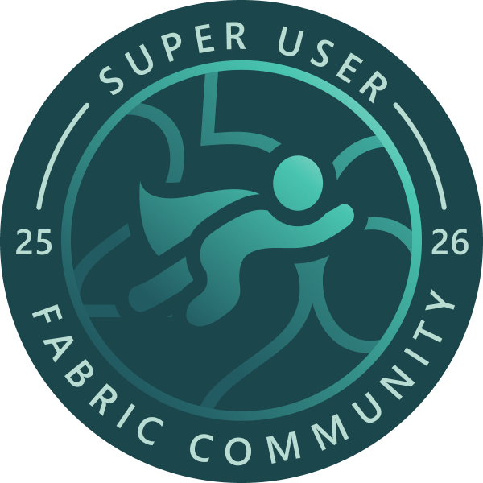

&nbsp;&nbsp;

# Jihwan Kim

**Enterprise BI Architect** | Microsoft Fabric | Power BI

    

---

- **Microsoft MVP** in Power BI — one of ~250 worldwide
- Architecting enterprise Fabric analytics at Fortune 500 scale — **30,000+ users** across **15 semantic models** powering **30 reports**
- Creator of open-source PBIP governance tools — **58+ GitHub stars** across 4 repositories
- Supply chain & logistics domain expertise — Samsung SDS, GXO Logistics, IKEA

---

## Open-Source Tools

Tools I built to solve real enterprise Power BI governance problems.

| Repository | What it does | Stars |
|------------|-------------|-------|
| [pbip-documenter](https://github.com/JonathanJihwanKim/pbip-documenter) | Generates semantic model documentation from PBIP metadata |  |
| [pbip-lineage-explorer](https://github.com/JonathanJihwanKim/pbip-lineage-explorer) | Visualizes end-to-end data lineage across models |  |
| [isHiddenInViewMode](https://github.com/JonathanJihwanKim/isHiddenInViewMode) | Bulk toggles visual visibility for governance control |  |
| [pbip-impact-analyzer](https://github.com/JonathanJihwanKim/pbip-impact-analyzer) | Analyzes change impact before refactoring semantic models |  |

---

### GitHub Stats

---

### Certifications

  

---

jonathan.jihwankim@gmail.com · [LinkedIn](https://www.linkedin.com/in/jihwankim1975/) · [Blog](https://powerbimvp.com/)
